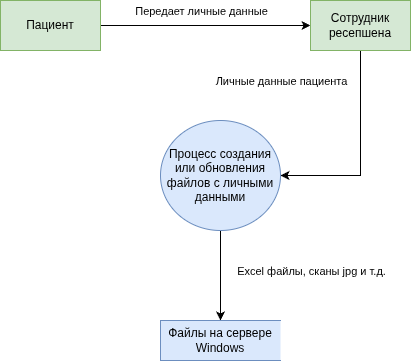
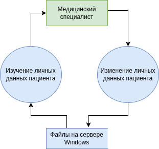
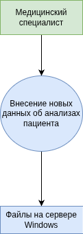
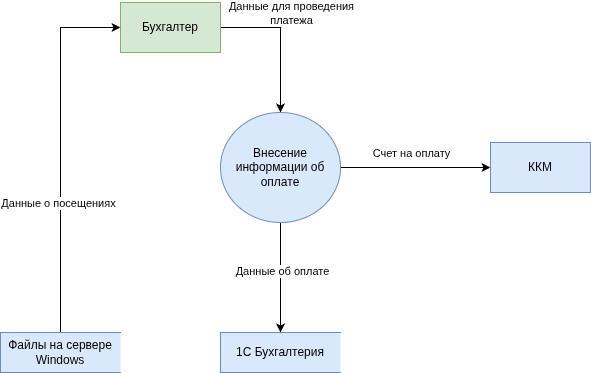
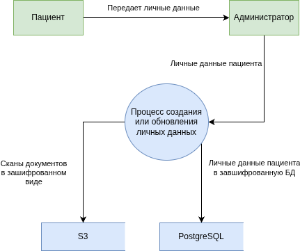
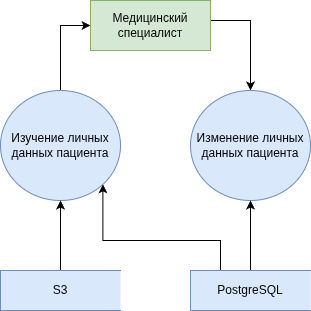
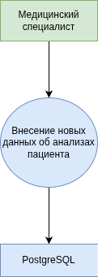
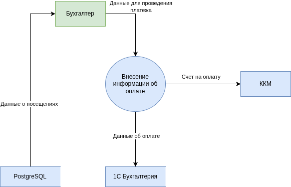

# Анализ безопасности системы

## Выявите конфиденциальные данные, которые не учтены во внутренних системах

-  Проанализируйте информацию о компании.
-  Создайте диаграммы потоков данных (Data Flow Diagrams). Для каждого процесса создайте отдельную диаграмму.
-  Отобразите на них, как данные перемещаются по системам компании и какие операции над ними совершают.

В данной компании отсутствуют меры по защите данных на системном уровне. Данные, хранящиеся в "1С Бухгалтерия" и "1С Торговля и склад" защищены системой 1С из коробки, однако любое взаимодействие с пациентом (оплата посещения, закупка материалов и т.д.) могут привести к утечке чувствительных данных.

Интерес представляют все данные, относящиеся к пациентам. Выяснилось, что вне всяких систем, кроме файловой системы Windows, находятся следующие данные:

- Журналы приёма пациентов
- Учёт пациентов и платежей
- Медицинские карты
- Учёт анализов

Всё это лежит в виде файлов MS Office или изображений прямо на общем диске Windows без серьезных мер по разграничению доступа.

Рассмотрим следующие бизнес-процессы.

### Запись пациента на прием

### Доступ врача к информации о пациенте

### Учет анализов

### Учет платежей

## Проведите аудит мер по обеспечению безопасности данных

- Сопоставьте процессы в компании с требованиями по обеспечению безопасности данных и архитектурными практиками в области безопасности конфиденциальных данных.
- Составьте список проблемных зон и сохраните его в отдельный документ.

### Аудит безопасности

|------------------------|----------------------------------------------------------------|--------------|-------------|
| Требование             | Текущее состояние                                              | Соответствие | Риск        |
|------------------------|----------------------------------------------------------------|--------------|-------------|
| Конфиденциальность ПДн | Данные хранятся в открытых файлах на общем диске.              | Нет          | Критический |
| Целостность данных     | Пользователи могут случайно или намеренно изменить данные.     | Нет          | Критический |
| Учет доступа           | Отсутствует мониторинг доступа к данным.                       | Нет          | Высокий     |
| Data Minimization      | Собираются избыточные данные.                                  | Нет          | Средний     |
| Privacy by Design      | Безопасность данных при проектировании не учитывалась.         | Нет          | Высокий     |
| Согласие на обработку  | Не понятно, дают ли пользователи согласие на обработку данных. | Нет          | Средний     |
|                        |                                                                |              |             |

### Список проблемных зон

Следующие проблемы сохранены в отдельном [документе](problems-list.md).

#### Критические проблемы

- Хранение медицинских документов и персональных данных в открытом виде на сетевом файловом ресурсе.
- Отсутствие политики классификации и тегирования данных. Невозможно отличить публичный прайс-лист от истории болезни.
- Нет системы управления доступом (IAM) на уровне приложений и данных. Доступ "всё или ничего".
- Полное отсутствие аудита действий пользователей с конфиденциальными данными.
- Уязвимые каналы передачи: Email без обязательного шифрования, общие диски.
- Архитектурная уязвимость: Монолитность и общие ресурсы (единый сервер, общие БД 1С) создают единую точку отказа и компрометации.

#### Проблемы среднего уровня

- Ручной ввод данных между системами (Excel, 1С) ведёт к ошибкам и необходимости избыточного доступа.
- Не определён жизненный цикл данных (Data Lifecycle). Нет политик автоматического архивирования и безопасного удаления.
- Отсутствие DLP-системы для контроля утечек через почту, USB и т.д.

## Подумайте, что можно улучшить

- Составьте список данных для защиты и проставьте для каждого способы защиты — шифрование, обфускация, обезличивание.
- Разработайте механизм тегирования данных с использованием инструментов тегирования.
- Составьте список инструментов, способов и мер, которые позволят обеспечить конфиденциальность данных в указанных потоках.
- Доработайте диаграммы из предыдущего шага: отобразите на них, что следует использовать на каждом этапе потока.

### Список данных для защиты и способ защиты

|---------------------|-------------------------------------|
| Тип данных          | Метод защиты                        |
|---------------------|-------------------------------------|
| Персональные данные | - Шифрование или токенизация        |
|                     | - Маскирование в логах              |
|                     | - Доступ по ролям                   |
|---------------------|-------------------------------------|
| Медицинская тайна   | Шифрование AES-256                  |
|                     | - Доступ по ролям                   |
|---------------------|-------------------------------------|
| Финансовые данные   | - Шифрование                        |
|                     | - Доступ по ролям                   |
|                     | (бухгалтеры, администраторы и т.д.) |
|                     |                                     |

### Способы защиты данных

Самый простой и сравнительно быстрый способ улучшить ситуацию -- смигрировать все данные в БД с шифрованием данных и разделением доступа по ролям.

Медицинские документы, которые должны храниться в бинарном виде (сканы в формате jpg и т.п.) можно хранить на S3-хранилище в шифрованном виде с разделением доступа по ролям.

По-видимому, следует разработать сервис для доступа к таким данным для сотрудников.

### Доработанные диаграммы

### Запись пациента на прием

### Доступ врача к информации о пациенте

### Учет анализов

### Учет платежей

