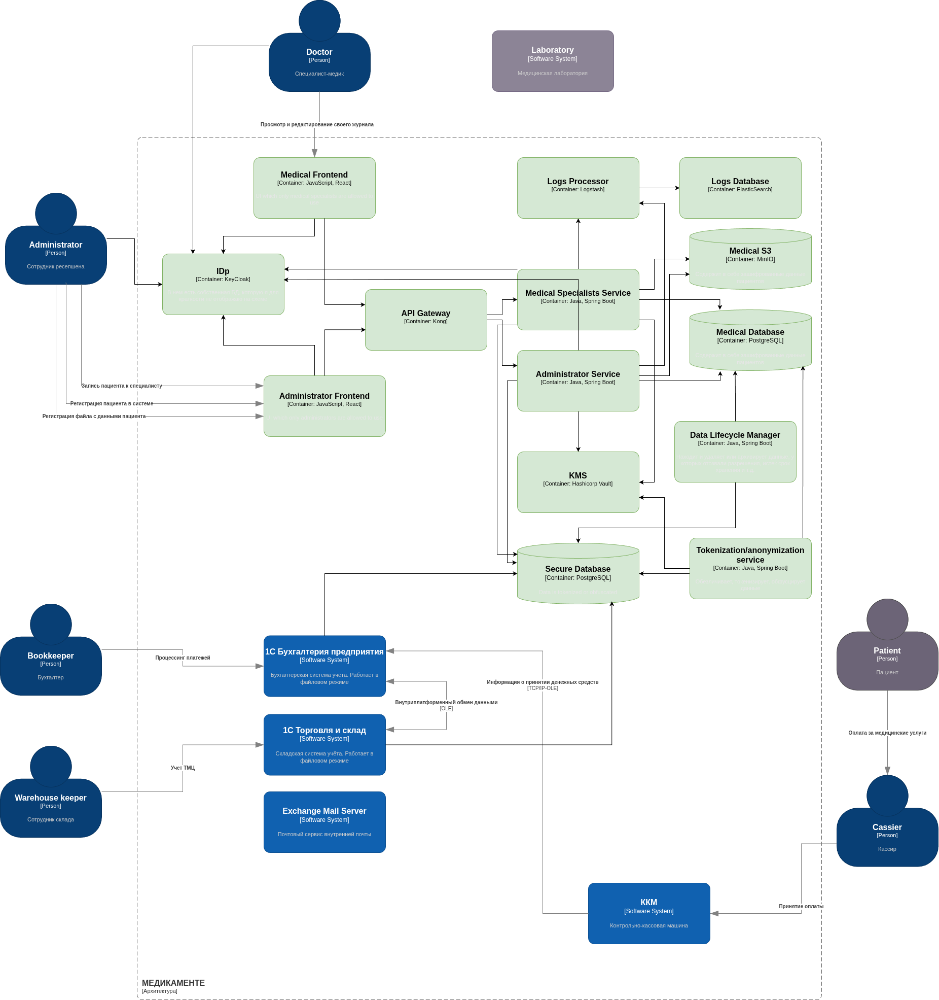

# Проектирование решения

## Что нужно сделать

- Предложить новые блоки в архитектуру проектируемой системе С4, которые обеспечат соблюдение принципов Privacy By Design во многих блоках реализуемой системы.
- Предложить в целевой архитектуре слой, который обеспечивает аналитическую работу с данными системы с учётом принципов Privacy by Design.

## Решение

### Frontend для доступа к информации

Ранее вся информация о пациентах хранилась в файлах на разделяемом диске сервера Windows, а также передавалась по email, и, возможно, не только по email. Таким образом, любой сотрудник, имеющий доступ к разделяемой папке, мог получить доступ ко всему объему информации. Следует разделить доступ к информации на основании роли пользователя.

Для этого предлагается сделать два отдельных фронтенда: для административного и для медицинского персонала. Указанные фронтенды агрегируют в себе все доступные каждой из ролей функции.

JavaScript-код фронтенда может доставляться как из CDN, так и с отдельного NGinx-сервера (в целях экономии места на схеме их я не отображал).

### IDP

Аутентификация и авторизация проходят через Keycloak (для экономии места на схеме БД Keycloak я не отображал). Keycloak предоставляет OIDC аутентификацию и удобные средства управления пользователями и ролями.

Пользователи фронтенда инициируют процесс аутентификации, браузер редиректит их на страницу Keycloak, пользователь аутентифицируется, и Keycloak отдаст на фронтенд ID Token, который бэкенды смогут верифицировать на Keycloak. Внутри ID Token -- JWT, предоставляющий достаточно информации для авторизации пользователя.

### API Gateway

На всякий случай есть смысл поставить на границе системы API Gateway (здесь -- Kong), который сможет ограничить количество запросов к сервисам, а также будет пропускать внутрь системы только запросы с валидным ID Token.

### Backend и KMS

Для каждого из фронтендов должен быть разработан собственный бэкенд. Они работают в связке с KMS (здесь --  Hashicorp Vault), предоставляющим сервисы шифрования и расшифровки данных.

Основные задачи каждого из бэкендов:

- Доступ к различным данным на чтение или на запись в зависимости от типа данных и роли пользователя.
- Шифрование данных при записи.
- Расшифровка данных при чтении.

### Storage

Вместо хранения всех данных в виде Excel-файлов и jpg-сканов, данные в зашифрованном виде будут храниться в БД (для структурированных текстовых данных) и S3 (здесь -- MinIO) для больших файлов, таких как jpg-сканы.

### ELK

Для сбора и обработки логов используется ELK-стек. Однако перед записью данных в логи их следует маскировать или токенизировать.

### Data Lifecycle Manager

Сервис запускается по расписанию раз в день и занимается удалением или архивированием (переносом в специальные хранилища для долговременного хранения) данных, у которых истек срок жизни, либо отозвали права на их обработку и хранение.

### Tokenization/Anonymization Service

Для того, чтобы фронтенды, а также различные сервисы могли отображать данные без раскрытия персональной или медицинской информации, должна быть создана дополнительная БД, в которой все данные будут либо токенизированы, либо анонимизированы, либо маскированы в зависимости от задачи.

Анонимизированные данные нельзя будет сопоставить с конкретным пациентом, но по ним можно будет провести какуюто аналитику.
Маскированные данные можно будет сопоставить с пациентом, но в них основная часть данных будет удалена или заменена на символ X.

Переносом данных по расписанию раз в некоторое время будет заниматься Tokenization/Anonymization Service.

Другие системы, работающие на базе 1С, будут иметь доступ только к этой безопасной БД, содержащей маскированные данные.
