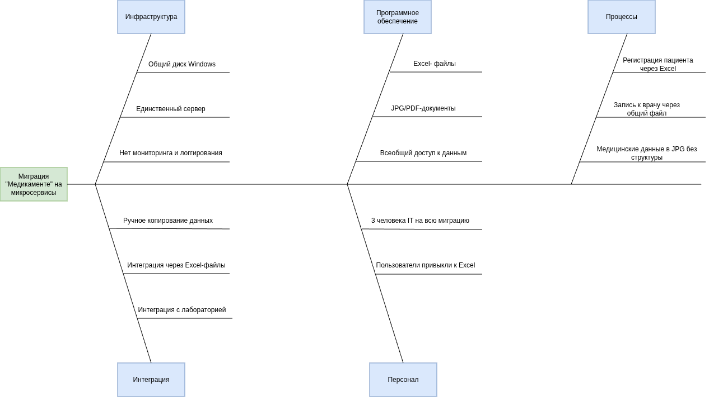

# Оценка узких мест при миграции

## Проанализировать ситуацию.

Текущая ситуация:

- Все файлы Excel, jpg на одном сервере Windows Server 2022 на общем диске
- Интеграции, передача данных вручную, через Excel и копирование данных
- Команда IT -- 3 человека

Ключевые процессы и компоненты, затрагиваемые миграцией:

- Процесс регистрации нового клиента
- Процесс записи клиента к специалисту
- Процесс заполнения медицинских данных клиента, включая и анализы
- Компоненты: файлы на общей папке Windows

## Диаграмма Исикавы

## Отчет по выявленным проблемам

### Инфраструктура

#### Общий диск Windows

Риски:

- Потеря данных при переносе
- Невозможность продолжать работу во время миграции

Возможные решения:

- Некоторое время поддерживать 2 системы и писать одновременно в обе
- Постепенный перенос. Сначала перенести статические данные, справочники, редко меняющиеся данные (старые анализы и т.д.). Потом те, которые используются каждый день.

#### Единственный сервер

Риски:

- Сбой сервера может привести к остановке работы всей компании
- Производительность системы может быть низкой

Возможные решения:

- Делать постоянные бэкапы всех изменившихся данных за день
- Для нового микросервисного решения запустить приложение в k8s на нескольких серверах

#### Нет мониторинга и логгирования

Риски:

- Трудно проанализировать что является источником низкой производительности
- Трудно найти причину сбоев

Возможные решения:

- Запустить Prometheus для мониторинга
- Запустить ELK для логирования

### Программное обеспечение

#### Excel-файлы

Риски:

- Некорректные данные
- Потеря связи между данными
- Блокирование параллельной работы над одним файлоа

Возможные решения:

- Разработать и запустить скрипт валидации и очистки данных
- Для параллельной работы над одним файлом возможно следует сделать доступ через web-интерфейс

#### JPG/PDF-документы

Риски:

- Нельзя искать по содержимому
- Файлы могут быть достаточно большими и влиять на производительность системы
- Нет версионности

Возможные решения:

- Хранить на MinIO
- Для сканов провести OCR, тогда можно будет искать по тексту

#### Всеобщий доступ к данным

Риски:

- Возможная порча или потеря данных
- Утечка данных

Возможные решения:

- Настроить более строгий доступ к файлам
- По возможности перевести работу над файлами через web-интерфейс
- Делать бэкап данных раз в день

### Интеграция

####  Ручное копирование данных

Риски:

- Риск человеческих ошибок при переносе данных
- Риск потери данных 
- Задержки в обновлении

Возможные решения:

- Разработать какие-то скрипты для автоматизированного копирования по расписанию

#### Интеграция через Excel-файлы

Риски:

- При переходе со старой системы на новую все старые интеграции перестанут нормально работать

Возможные решения:

- Поддерживать обе версии системы одновременно
- Разраотать автоматические скрипты переноса данных из Excel в новые точки интеграции

#### Интеграция с лабораторией

Риски:

- Конфиденциальность данных может быть под угрозой
- Форматы данных интеграции могут отличаться

Возможные решения:

- Разработать сервис-адаптер, позволяющий какое-то время работать старым механизмам интеграции

### Персонал

#### 3 человека IT на всю миграцию

Риски:

- Возможная нехватка знаний, опыта, навыков
- Перегруженность, возможность выгорания

Возможные решения:

- Провести ревизию знаний и навыков, необходимых для миграции
- Нанять людей с недостающими компетенциями

### Пользователи привыкли к Excel

Риски:

- Сопротивление изменениям

Возможные решения:

- Провести некий аналог "соцсоревнования", кто быстрее адаптируется к новой системе
- Ввести KPI по внедрению новой системы, влияющий на премию
- Провести обучение сотрудников использованию новой системы

### Процессы

#### Регистрация пациента через Excel

Риски:

- Отсутствие валидации данных
- Нет истории изменений
- Невозможность параллельной работы

Возможные решения:

- Необходим web-сервис для работы с указанными данными

#### Запись к врачу через общий файл

Риски:

- Легко нарушить расписание
- Сложно перенести все записи в новую систему

Возможные решения:

- Необходим web-сервис с проверками и правильно построенной бизнес-логикой
- Для переноса данных нужен отдельный скрипт

#### Медицинские данные в JPG без структуры

Риски:

- Невозможно что-то найти текстовым поиском по этим документам

Возможное решение:

- Провести OCR по документам

