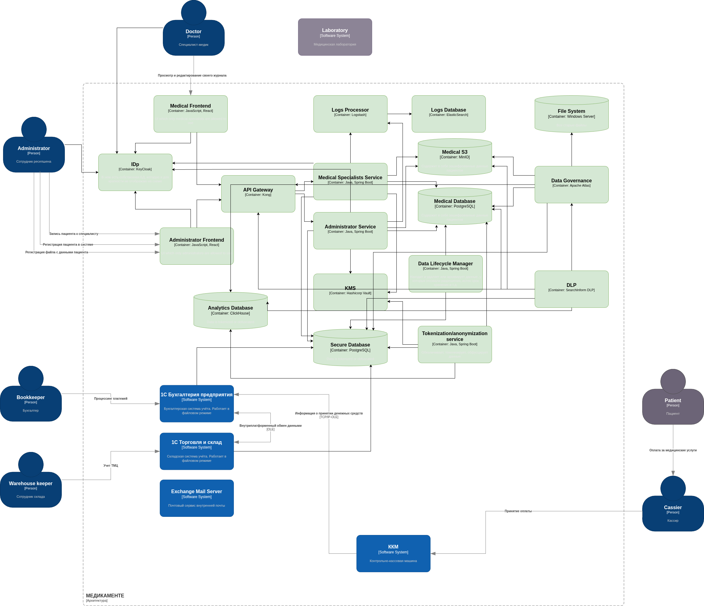

# Классификация данных

В данной архитектуре Apache Atlas будет заниматься добавлением метаинформации ко всем данным, которые, затем, будет использовать DLP-система. Так, Apache Atlas будет классифицировать старые данные с общего диска Windows Server, регулярно сканировать БД, MinIO.

Самый простой и достаточно надежный способ классифицировать данные -- воспользоваться регулярными выражениями. В случае, если этого окажется недостаточно, можно будет задейстовать ML-модуль.

DLP-система сможет контролировать доступ к данным основываясь на метаинформации, предоставляемой Apache Atlas.
